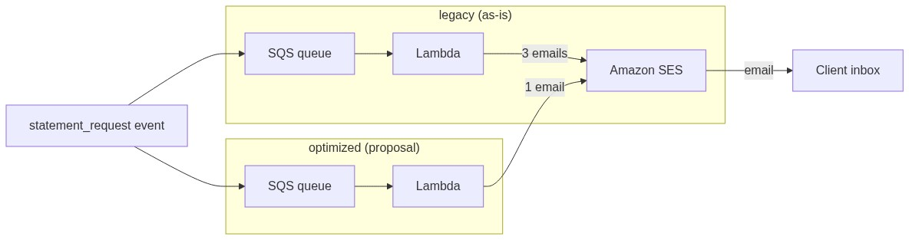

# ✉️ AWS Notification Optimizer

## 📌 Project Overview
An A/B POC of a serverless notification pipeline: consolidating redundant email broadcasts via **SQS + Lambda + SES**. The scenario is based on a real broker setup: the broker sends a client **3 emails and 2 push notifications** for a single action — requesting a brokerage account statement. The project shows how the "as-is" (legacy) flow becomes the "should-be" (optimized) flow while keeping the mandatory notification (Bank of Russia Regulation No. 503-P).

> **Note on Mandatory Emails:** Under Bank of Russia Regulation No. 503-P (ch. 12), only the statement on client request (12.3) and the operation report (12.1) are mandatory; their delivery form is set by the depositary agreement — which makes a consolidated "1 email + record in the personal account" approach compliant.

## 🏗️ Architecture Diagram

One `statement_request` event is routed to both stacks: the legacy one sends 3 emails, the optimized one a single consolidated email. Flow: `SQS -> Lambda (Python 3.13) -> SES`.

## 🛠️ Key Technical Features
* **Region:** Asia Pacific (Tokyo) / `ap-northeast-1`
* **Infrastructure as Code:** a single reusable Terraform module `sqs_lambda`, instantiated via `for_each` for the legacy/optimized stacks.
* **Event-Driven:** event is published to SQS; `aws_lambda_event_source_mapping` triggers the handler (`batch_size = 1`).
* **A/B Modes:** one Terraform variable toggles `legacy` / `optimized` / `both` stacks.
* **Python 3.13** runtimes with least-privilege IAM (SQS + SES + basic Lambda execution).
* **Email Delivery:** Amazon SES with a verified identity; a `sent:` counter is written to CloudWatch logs.

## ✅ Validation
One `statement_request` event was sent to each queue; raw evidence captured from CloudWatch log exports:

| Mode | Emails per event | Evidence |
|---|---|---|
| `legacy` (as-is) | **3** — accepted + executed + statement | [CloudWatch logs (CSV)](docs/logs/legacy.csv) |
| `optimized` (proposal) | **1** — mandatory statement only | [CloudWatch logs (CSV)](docs/logs/optimized.csv) |

### Deliverability finding
SES email-identity sends land in **Gmail Spam**; the **real broker emails sit in Mail.ru Spam** too — the mandatory statement genuinely risks never reaching the inbox. Production path: SES **domain identity + DKIM/SPF/DMARC + custom MAIL FROM** — see [docs/deliverability.md](docs/deliverability.md).

## 📑 Compliance
What can and cannot be dropped under Bank of Russia Regulation No. 503-P (ch. 12) — see [docs/compliance.md](docs/compliance.md).

## 🔒 Security & Observability
* **Least Privilege:** IAM scoped to SQS + SES + basic Lambda execution only; no hardcoded secrets.
* **Cost Control:** a monthly **cost budget alert ($1)** caught the actual demo spend.
* **Observability:** per-stack CloudWatch log groups with request IDs and `sent:` counters.

## 📂 Repository Structure
* `/infra` — Terraform IaC (module `sqs_lambda`, `main.tf`, `ses.tf`, `variables.tf`)
* `/lambda` — Python handlers: `legacy` (3 emails), `optimized` (1 email), `common` (sample event)
* `/docs` — compliance analysis, deliverability findings, raw validation logs
* `/images` — architecture diagram

## 🛠️ Stack
AWS | Terraform | Python | SES | SQS | Lambda | CloudWatch